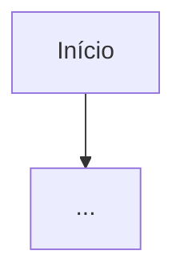

# <Nome da Automação>

## Descrição

Objetivo principal e por quê ela existe.

## Dados de entrada

O que ela consome (API, arquivo, banco).

## Gatilho

- [ ] GitHub Actions
- [ ] systemd timer

## Fluxo

## Estrutura interna

- imports/dependências principais
- tabelas do banco usadas
- tempo de execução esperado

## Observabilidade

- onde ficam os logs
- tempo medido via `shared.observability`

## Trade-offs

(alimentar conforme for desenvolvendo)

## Componentes globais usados

Quais módulos de `shared` essa automação depende.
