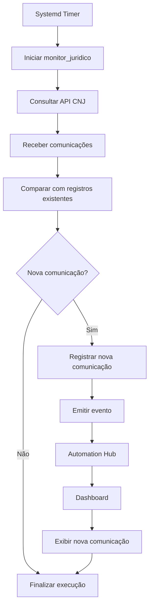

# contexto

Escritórios de advocacia precisam acompanhar constantemente novas comunicações e intimações publicadas nos processos em que atuam.

Esse acompanhamento pode exigir consultas recorrentes por número de OAB ou por número de processo, tornando a verificação manual uma tarefa repetitiva e operacional.

A API pública de consulta do CNJ permite consultar essas comunicações sem autenticação.

# consequência / problema

A verificação manual pode fazer com que a equipe precise consultar periodicamente a existência de novas publicações.

Isso gera:

- trabalho operacional repetitivo;
- necessidade de consultar processos ou OABs manualmente;
- risco de uma nova comunicação não ser percebida rapidamente;
- dificuldade para centralizar o acompanhamento das publicações.

A API utilizada é baseada em consulta (polling), portanto ela não envia notificações automaticamente quando uma nova comunicação aparece.

# objetivo

Criar uma automação que consulte periodicamente a API pública de comunicações do CNJ, identifique novas publicações que ainda não foram registradas e disponibilize essas novas ocorrências no Automation Hub.

O monitor deve funcionar como uma camada automatizada de vigilância, reduzindo a necessidade de consultas manuais e permitindo que novas comunicações sejam identificadas e apresentadas no dashboard.

# ideias soluções

1. ## name : **monitor_juridico**

- ### objetivo

  > Monitorar periodicamente novas comunicações/intimações através da API pública de consulta do CNJ, utilizando OAB ou número de processo como critério de consulta, comparar os resultados com os registros já conhecidos e identificar novas publicações.

  > Quando uma nova comunicação for encontrada, registrar a ocorrência e disponibilizar o evento para o Automation Hub.

- ### fases

1. **Consulta**
   - Consultar a API pública do CNJ.
   - Utilizar OAB/UF ou número de processo como parâmetro.
   - Definir uma janela de datas para a consulta.

2. **Identificação de novas comunicações**
   - Receber o JSON retornado pela API.
   - Comparar as comunicações retornadas com as já registradas.
   - Identificar somente novas ocorrências.

3. **Persistência**
   - Registrar as novas comunicações encontradas.
   - Manter histórico das ocorrências já processadas para evitar duplicidade.

4. **Notificação**
   - Quando uma nova comunicação for identificada, emitir o evento para o Automation Hub.
   - Disponibilizar a nova ocorrência no dashboard.

5. **Monitoramento contínuo**
   - Executar novamente em intervalos definidos pelo scheduler.
   - Exemplo: a cada 15 ou 30 minutos.
   - Repetir o processo de consulta e comparação.

- ### fluxo mermaid



# flar

> "vi que vocês publicam no site que atuam em execução fiscal, onde prazo é crítico; pesquisei e vi que o CNJ centralizou tudo isso no DJEN com API pública; montei um protótipo que monitora isso em tempo real usando a mesma infra que já tenho rodando (automation-hub)." Isso comunica iniciativa + entendimento do negócio jurídico, que é exatamente o que a vaga pede ("desenvolver ferramentas internas que possam facilitar e otimizar as atividades do escritório").

```
CLIENTE
   │
   │ contrata
   ▼
ADVOGADO
   │
   │ peticiona/protocola
   ▼
SISTEMA DO TRIBUNAL
   │
   ▼
DISTRIBUIÇÃO
   │
   ▼
VARA / CARTÓRIO / UNIDADE JUDICIAL
   │
   ▼
JUIZ
   │
   │ decisão / despacho / sentença
   ▼
SISTEMA DO TRIBUNAL
   │
   │ disponibiliza/publica
   ▼
ADVOGADO
   │
   ▼
CLIENTE
```

```
Sou estudante de Análise e Desenvolvimento de Sistemas na Unisinos e venho construindo minha experiência em tecnologia principalmente através de projetos práticos. Tenho foco em desenvolvimento de software, automação e integração de sistemas, trabalhando principalmente com Python, APIs, bancos de dados, Docker e CI/CD. Tenho bastante interesse em entender processos, identificar tarefas repetitivas e transformar esses problemas em soluções automatizadas.

UPWORK

No Upwork, atuei com suporte a sistemas, trabalhando diretamente na identificação e resolução de problemas técnicos. Eu recebia situações em que algo não estava funcionando como esperado, investigava o comportamento do sistema, identificava a causa do problema e aplicava a correção necessária. Também acompanhava o sistema após as alterações para garantir que continuasse funcionando corretamente. Essa experiência me aproximou de problemas reais de software e me ensinou a investigar antes de simplesmente tentar uma solução.
OUTLIER

Na Outlier, trabalhei com avaliação e validação de sistemas de inteligência artificial. Minha atividade envolvia analisar respostas de modelos de linguagem, verificar se estavam de acordo com critérios técnicos e identificar inconsistências, erros e comportamentos inesperados. Essa experiência me deu uma visão mais crítica sobre qualidade de software e também aumentou meu interesse em utilizar inteligência artificial e automação para melhorar processos.

AUTOMATION-HUB — MONITOR_JUDICIARIO

No meu projeto Automation Hub, eu queria aplicar automação a um problema real e percebi uma oportunidade na área jurídica. Escritórios precisam acompanhar novas comunicações e intimações, mas a API pública do CNJ funciona através de consultas, então seria necessário verificar periodicamente se havia novas ocorrências.

A partir disso, criei o Monitor Jurídico, uma automação que consulta a API periodicamente utilizando OAB ou número de processo, recebe os resultados e compara as comunicações encontradas com as que já foram registradas. Quando identifica uma nova comunicação, ela é persistida e o evento é enviado para o Automation Hub, onde pode ser disponibilizado no dashboard.

A automação é executada por um scheduler, permitindo que esse processo aconteça continuamente sem depender de uma pessoa realizando as consultas manualmente. Eu fiz isso justamente para testar a ideia de pegar um processo operacional real, entender como ele funciona e transformar uma tarefa repetitiva em uma solução automatizada.

Quando conheci a vaga, achei particularmente interessante porque percebi que esse é exatamente o tipo de problema que vocês estão procurando alguém para resolver: entender os processos do escritório e desenvolver ferramentas internas que reduzam trabalho manual e otimizem a operação.
```
